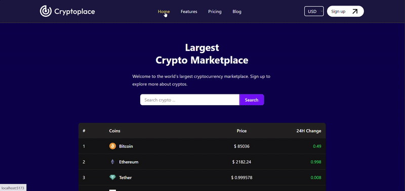

# 🪙 Cryptoplace

This is a crypto database project that displays more that 100 different cryptocurrencies. The price and latest changes of all cryptocurrencies are shown on the home page. Also each currency has its own detail page which includes more detail about it.

# 🚀 Features

- Searching and filtering 
- Current values for USD and EUR currencies
- Cryptocurrencies rankings by ther market value
- Price and 24H Change datas
- Line Chart that shows increase/decrease of the values in last 14 days

# 🛠️ Used Technologies and Libraries

- React-js
- Vite
- React-Router-DOM
- Axios
- React-icons
- Tailwindcss
- React-google-charts
- Coingecko API

# Preview

